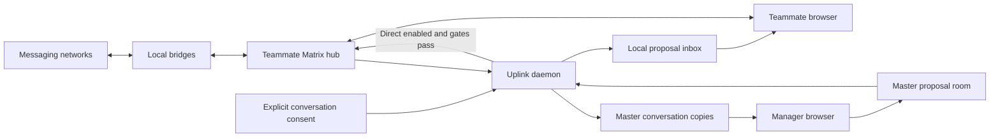

# Beepa codebase review

**Reviewed:** September 4, 2026 (America/Los_Angeles)

**Code baseline:** `040eb8c`

**Scope:** Architecture, implemented behavior, failure handling, privacy boundaries, installation, and test coverage. Review only; product code was not changed.

This document records the original baseline. Subsequent authorized repairs are
described in [the implementation report](IMPLEMENTATION-REPORT-2026-09-04.md),
with operating instructions in [Updates](UPDATES.md) and
[Master operations](MASTER-OPERATIONS.md). The findings below remain historical
evidence, not a claim that the repaired checkout still has every defect.

## Assessment

Beepa is a substantial working prototype of a personal messaging hub with a team oversight layer. It has real bridge integrations, meaningful authorization checks, and unusually thorough tests for its consent resolver. It also has serious gaps in delivery recovery and disconnection/revocation, plus documentation that describes an older, materially different product.

**I would not yet rely on it as a complete message archive, a guaranteed delivery system, or a system that can retract previously shared messages.** Before a wider team rollout, I would address the high-priority findings below and test a clean installation under a username other than the author's.

The main pattern is that individual operations are carefully guarded, while transitions between operations are less reliable: disconnecting, re-enrolling, recreating a mirror, recovering from an outage, and switching conversations during pending requests. Green unit tests currently coexist with reproducible defects in these transitions.

The code's reported authorship does not establish why these defects exist. This assessment is based on source and observed behavior, not on an inference about Claude or another coding tool.

## What it actually does

Each teammate runs a private Matrix homeserver and bridge services on their computer. External conversations become Matrix rooms. A browser app displays those rooms and sends text through the local homeserver. A separate Python uplink copies selected conversations to a second, team-owned Matrix homeserver. The manager's browser reads those copies and creates proposal events.

There are **two materially different ways a proposal becomes a message**: the teammate can review and send it, or the uplink can send it automatically for a conversation explicitly set to **Direct**.

| Capability | Current implementation |
|---|---|
| Network integrations | WhatsApp, Google Messages, Instagram, LinkedIn and X through five mautrix bridges; iMessage through a custom host daemon and a native CLI. Presence of code/configuration is verified; current live connectivity to each network was not tested. |
| Personal inbox | Static JavaScript app, conversation/source lists, recent history, text composer, connection controls, contacts and proposal inbox. |
| Conversation sharing | Explicit per-room `private`, `share`, or `direct`. Missing/unrecognized values are private. Old global/source/profile conversation rules no longer authorize sharing after migration. |
| Bulk sharing | Writes an explicit level to the conversations selected now. It is not a standing rule that automatically shares future conversations. Bulk Direct has a confirmation. |
| Contact sharing | A separate policy system for address-book data, with source/global rules and per-handle overrides. Sharing a contact is not the same as sharing its conversations. |
| Manager proposals | A custom Matrix event in a dedicated proposal room. Ordinary shared conversations require teammate action. Direct conversations can be sent automatically, subject to sender, freshness, consent, rate and other gates. |
| Contacts | Imports macOS Contacts into SQLite under the iMessage source; resolves numbers from WhatsApp, Google Messages and iMessage bridge data; can automatically group conversations by matching phone number. |
| Enrollment | One-time codes yield a scoped account/token on the master. GUI enrollment uses a host helper; CLI enrollment writes an environment file. |
| Remote master | Uplink can reach a remote master; a Tailscale exposure script exists. The manager browser itself is configured for local `8018`/`8019`, not arbitrary remote deployment. |
| Media | Uplink attempts size-limited re-upload. Failures become placeholders. The teammate conversation renderer uses media labels; the manager renderer has media loading. |

The central paths are [uplink.py](../agents/uplink/uplink.py), [consent.py](../agents/uplink/consent.py), [user app](../apps/user/main.js), [manager app](../apps/master/main.js), and [iMessage daemon](../imessage/daemon.py).



### Data and trust boundaries

The local PostgreSQL volume contains Synapse and bridge databases, including message/session state. The master has a separate PostgreSQL volume. Media also lives in filesystem directories. SQLite databases record iMessage mappings, uplink progress, and imported contacts. Matrix account-data holds policies, profiles and GUI enrollment credentials; shell files hold CLI credentials and installation secrets. Provisioning also writes app-session tokens into the static app directories for passwordless local login.

This is a plaintext aggregation system at the application storage boundary. External services' encryption does not make the resulting local/master archives end-to-end encrypted. Loopback binding reduces exposure, but the local machine and master operator remain trusted. Direct adds an explicit remote sending capability for the manager identity in the selected conversations.

## What it does not currently provide

- **A complete, lossless archive.** Initial uplink history is capped at 500 events; several recovery paths can omit additional history. The custom iMessage poll only processes a recent 25-message window.
- **Proof of delivery to the recipient.** A successful local Matrix send establishes acceptance by the local homeserver. The custom iMessage bridge can subsequently fail while the transaction is still acknowledged.
- **Retraction of already shared information.** Unsharing is not a purge, and a manager may retain previously readable history. Copies, exports and backups are outside these controls.
- **A full Matrix client.** The native views expose recent windows and selected event types. Search operates on loaded conversation metadata/previews, not a complete archive search. The teammate renderer uses attachment placeholders. Element is an optional escape hatch.
- **General cross-platform one-click installation.** The provided host-service installation uses launchd; cookie capture reads macOS Chrome storage and Keychain. Docker portability alone does not make the whole product portable.
- **A remotely configurable manager frontend.** Its server URLs and CSP are fixed to local addresses; a remote master deployment needs an additional access/configuration arrangement.
- **An AI reply engine identified in this review.** The `agents/` directory primarily contains synchronization, contact-import and identifier-resolution services. Manager-authored proposals are not evidence of an LLM integration.
- **A demonstrated backup/restore, retention, or disaster-recovery workflow.** There are reset commands and a database-dump example, but this review found no comprehensive, tested restoration path for all databases, media, mappings and secrets together.

## Priority overview

“High” means a privacy/authority mismatch, message loss, or failure of a core supported workflow. “Medium” means significant incorrect behavior or operational fragility. A reproduced finding uses synthetic inputs against production functions; it does not mean the defect was observed in your real messages.

| ID | Priority | Finding | Evidence level |
|---|---|---|---|
| R1 | High | Main documentation incorrectly promises the manager cannot send | Source-confirmed |
| R2 | High | Unsharing does not revoke previously readable history | Source + Matrix specification |
| R3 | High | Failed revocation is recorded as completed and forgotten | Reproduced |
| R4 | High | Disconnect can resume the CLI-configured master link | Reproduced |
| R5 | High | Limited sync responses create permanent message/proposal gaps | Uplink gap reproduced; proposal path source-confirmed |
| R6 | High | Interrupted initial backfill has no effective retry | Reproduced |
| R7 | High | Re-sharing skips events copied to the previous mirror | Reproduced |
| R8 | High | iMessage commits completion despite delivery failure | Both directions reproduced |
| R9 | High | Login helpers use the author's identity on other users' installs | Source-confirmed |
| R10 | High | Privacy changes are not applied before every forwarding pass | Reproduced |
| R11 | High | Changing master retains old mirror/contact state | Reproduced |
| R12 | Medium | Phone-originated iMessage sends can be mislabeled as incoming on master | Reproduced |
| R13 | Medium | Switching conversations can permanently stop the active live watch | Reproduced |
| R14 | Medium | Re-running setup overwrites locally edited bridge configuration | Source-confirmed |
| R15 | Medium | A failure in one uplink subsystem can stall unrelated work | Source-confirmed |

## Findings and repair criteria

### R1 — The main documentation promises a different authority model

[README.md](../README.md), [SYSTEM-DESIGN.md](SYSTEM-DESIGN.md) and [INSTALL.md](../INSTALL.md) say that managers cannot send and that every proposal requires teammate action. The implementation explicitly supports automatic sends in [uplink.py:1680](../agents/uplink/uplink.py#L1680) and [uplink.py:1746](../agents/uplink/uplink.py#L1746). The current UI explains this clearly in [consent.js:451](../apps/user/consent.js#L451), including the compromised-manager risk.

**Impact:** Someone assessing the system from its front-door documentation could approve a different security/product model from the one installed. The four-layer conversation consent explanation and “contacts never merge automatically” claim are also obsolete.

**Repair criterion:** Rewrite the current product references around explicit Private/Share/Direct, separate contact policy, automatic number grouping, and the actual trust boundary. Direct itself is an intentional feature with explicit consent; its existence is not evidence of an authorization bypass. Mark historical plans and old audits clearly as historical.

### R2 — Even a successful kick does not retract readable history

[delete_mirror](../agents/uplink/uplink.py#L1152) removes a space link, kicks the manager, and leaves the room. It does not purge the room or redact its history. Its comment claims the durable copy becomes unreachable by the manager.

Matrix permits departed members to access events they could previously read; a kick has the same membership effect as leaving. Therefore hiding/unlinking the room in this console does not establish historical access revocation. This is a protocol-based conclusion, not a live attack tested against your server. [Matrix history visibility](https://spec.matrix.org/v1.15/client-server-api/#room-history-visibility), [leaving rooms](https://spec.matrix.org/v1.15/client-server-api/#leaving-rooms).

**Impact:** The promise that the manager loses “all access” is too strong even when every cleanup request succeeds. Contacts tombstones likewise do not retract earlier state events or copied data.

**Repair criterion:** Choose and document the intended retention model: stop future sharing, remove from the ordinary UI, and retain prior copies; or add a separately specified server-side deletion process. Neither choice can erase a manager's independent copies. Do not treat a successful kick as proof of deletion.

### R3 — HTTP failures during revocation are silently discarded

In [uplink.py:1167](../agents/uplink/uplink.py#L1167), each unlink/kick/leave operation catches any `HTTPError` and continues. The local mirror mapping is then deleted unconditionally.

**Reproduction:** All three fake master requests returned HTTP 503. `delete_mirror()` returned normally and removed the mapping. The next reconcile has no record that cleanup is still required. A failed kick followed by a successful owner leave can also make subsequent ordinary-client cleanup harder.

**Impact:** The UI/policy says Private while an accessible master room may remain. Future forwarding stops once the mapping disappears, but outstanding cleanup is abandoned.

**Repair criterion:** Persist revocation progress; stop forwarding immediately; retry failed steps; distinguish verified “already removed” outcomes from temporary/authorization errors; delete the local record only when the chosen cleanup contract is satisfied. Exercise failure after every individual step.

### R4 — “Disconnect” is not authoritative

The Disconnect handler writes `{}` into `com.jkali.master_link` in [orglink.js:179](../apps/user/orglink.js#L179). [refresh_master_config](../agents/uplink/uplink.py#L2326) interprets that as absence and falls back to environment credentials. [run-uplink.sh](../agents/uplink/run-uplink.sh) loads those credentials for CLI-enrolled installations.

**Reproduction:** With valid synthetic environment credentials and an empty GUI link, `refresh_master_config()` returned connected and selected the old master.

**Impact:** An installation using the CLI enrollment path can continue syncing after the GUI reports Not connected. On a GUI-only installation, disconnect stops the loop but also bypasses cleanup of existing remote mirrors. It does not itself revoke the issued master token.

**Repair criterion:** Store an explicit disabled/disconnected state that overrides every credential source. Define separately what stopping sync, removing remote copies and revoking credentials mean, and report their status accurately.

### R5 — A sync cursor does not guarantee complete recovery

[tail_once](../agents/uplink/uplink.py#L2302) forwards only the returned timeline, then saves `next_batch`. It never examines `timeline.limited` or paginates a gap. [pull_proposals](../agents/uplink/uplink.py#L1911) does the same with a 100-event timeline limit.

**Reproduction:** A fake response explicitly marked `limited: true` caused one `/sync` request, forwarding only the newest supplied event and moving the cursor past the gap. No `/messages` recovery occurred. Matrix documents pagination as the mechanism for filling such gaps. [Matrix syncing](https://spec.matrix.org/v1.15/client-server-api/#syncing).

**Impact:** Long outages or bursts can silently omit conversations' messages, edits/redactions, or proposals. Successfully delivering every event in the returned array is weaker than delivering every event since the last saved position.

**Repair criterion:** Implement gap pagination in both directions with durable progress, then test an offline burst larger than the server's returned window. Proposal recovery must preserve the rule that stale historical proposals are not auto-sent.

### R6 — An interrupted backfill becomes a permanently “kept” mirror

[create_mirror](../agents/uplink/uplink.py#L1136) commits the mirror mapping before backfill. If backfill fails, the next reconcile treats the room as existing. The apparent catch-up call, [sync_room](../agents/uplink/uplink.py#L1203), simply returns.

**Reproduction:** Backfill raised a synthetic outage after mirror creation. A subsequent real reconcile retained the mirror and made no second backfill attempt.

**Impact:** Initial history outside later live sync windows is lost from the master copy. A second durability window exists before the mapping is committed: remote room creation followed by failed space linking can leave an unrecorded room and a retry can create another.

**Repair criterion:** Model provisioning/backfill as durable stages with resumable pagination and recovery of partially created rooms. Keep committed progress for already copied events. Merely moving the SQLite insert after backfill trades one failure window for another.

### R7 — Re-sharing uses the old mirror's deduplication ledger

[delete_mirror](../agents/uplink/uplink.py#L1183) deletes `mirror_rooms`, but leaves `event_map`. [forward_events](../agents/uplink/uplink.py#L1223) skips every event ID already in that global map, regardless of which master room received it.

**Reproduction:** A previously copied event was offered to a fresh replacement mirror. Zero events were posted because the old mapping still existed.

**Impact:** Re-sharing a conversation can produce an empty or incomplete new history. Edit/redaction targets can also refer to events in an obsolete mirror.

**Repair criterion:** Scope event mappings to destination/mirror generation and source room, with explicit treatment of old generations. Test share → messages → private → share, including edits and redactions. Do not clear unrelated rooms' deduplication records.

### R8 — iMessage can lose messages in both directions

**Inbound:** [handle_chat_delta](../imessage/daemon.py#L726) inserts and commits `seen_msg` before `deliver_inbound()`. Failures in portal creation or message relay do not remove that record. The poll's limited recent window is an additional catch-up limitation.

**Reproduction:** First delivery failed; a second poll saw the stored row and did not retry. There was one delivery attempt over two polls.

**Outbound:** [Handler.do_PUT](../imessage/daemon.py#L1293) catches individual handler exceptions, then marks the whole transaction done and returns 200. [handle_event](../imessage/daemon.py#L1137) also only logs a false engine send result.

**Reproduction:** A synthetic handler failure still called the transaction-completion marker and returned HTTP 200. The real marker commits that transaction to SQLite.

**Impact:** Incoming messages can be absent from Matrix indefinitely. Outgoing messages can appear accepted in Matrix while never reaching iMessage. No automatic retry is requested by the acknowledged transaction.

**Repair criterion:** Separate received, pending, delivered, refused and ambiguous outcomes at event granularity. Commit incoming completion only after durable success. For outbound sends, persist intent and recover ambiguity without blindly duplicating a message the engine may already have sent. Add isolated daemon tests; the ordinary unit suite does not exercise this daemon's transaction/delivery lifecycle.

### R9 — A clean install's identity differs from its login helpers' identity

[setup.sh:71](../setup.sh#L71) selects and persists a local username; templates use `LOCAL_MXID`; local provisioning creates that account. But [gmessages-connect/connect.py:21](../gmessages-connect/connect.py#L21) and [session-connect/connect.py:40](../session-connect/connect.py#L40) hardcode `USER_ID = "@jkali:localhost"`. Their provisioning requests use that constant.

**Impact:** With a different installed username, one-click Google Messages/Instagram/LinkedIn/X login targets the wrong Matrix identity. Depending on bridge checks, it will fail or attach a login to the wrong account. The mismatch is confirmed; a real non-author bridge login was not attempted.

**Repair criterion:** All bridge helpers must consume the same install identity as provisioning and rendered permissions. A clean non-`jkali` install test should inspect the resulting account, configuration permissions and login request identity. Existing-instance success is insufficient evidence of portability.

### R10 — Privacy changes are delayed and can wait behind unrelated work

Conversation consent is refreshed during reconciliation, nominally every 30 seconds. [tail_once](../agents/uplink/uplink.py#L2302) trusts the existing mirror table and does not process new privacy overrides before forwarding. [reconcile](../agents/uplink/uplink.py#L991) creates/backfills new mirrors **before** processing revoked ones.

**Reproduction:** A synthetic `/sync` response containing a Private override and a message for the same room still forwarded that message.

**Impact:** Private is not an immediate stop boundary. Under normal conditions there is a polling window; long backfills, a blocked operation or repeated failures can extend it. Direct auto-send has a fresh consent check, which is a useful stronger model than the mirror-up path currently uses.

**Repair criterion:** Apply revocations before new work, suppress forwarding as soon as a privacy change is observed, and define whether a point-read is required before each batch. Surface pending revocation instead of implying completion when only account-data has been saved.

### R11 — Master changes reset only part of the state

[refresh_master_config](../agents/uplink/uplink.py#L2326) can select a different master. [refresh_direct_send_binding](../agents/uplink/uplink.py#L1588) correctly suspends automatic sends and resets proposal state, but retains mirror mappings, contact-room metadata, contact deduplication and other destination-specific state. The loop attempts reconciliation/tailing before the proposal binding refresh.

**Reproduction:** Changing the synthetic master URL suspended Direct, while the old mirror ID and contacts-room ID remained.

**Impact:** Reconnection is not a clean migration. Requests can address old rooms on the new server/account, new mirrors may never be provisioned, and shared contacts may be incorrectly considered already copied. A credential-source read failure can also fall back to the old environment configuration.

**Repair criterion:** Bind all destination-specific state to one master identity/generation before any remote operation. Specify old-master cleanup separately. Existing issue `pm_mng-1qf` already records this broader resilience/state-reset work.

### R12 — iMessage direction metadata is overwritten incorrectly

The iMessage daemon sends phone-originated outgoing messages as `@imessagebot` with `com.jkali.from_me: true` in [daemon.py:780](../imessage/daemon.py#L780). [uplink.py:1343](../agents/uplink/uplink.py#L1343) overwrites this field using only equality with the local user or the configured self-identity set.

**Reproduction:** With the default empty attested self-identity set, a daemon-authored outgoing message's `from_me` became false on the master.

**Impact:** Managers can see the teammate's own phone-sent message attributed/aligned as incoming. This affects interpretation of the conversation, even though it does not itself grant send authority.

**Repair criterion:** Preserve the signal only for a verified iMessage-bot/source combination, or establish an equivalent trusted identity mapping. Do not trust arbitrary incoming `from_me` fields.

### R13 — A stale conversation-open request can disable live updates

[openConvo](../shared/ui/chat.js#L84) awaits history and then calls `startConvoWatch(roomId)` even if selection changed. [startConvoWatch](../shared/ui/chat.js#L146) sets one global `convoRunning` flag before checking whether that room is still selected; a stale invocation can set the flag and exit without starting a poll.

**Reproduction:** Select A, then B. Complete A's history request before B's. A's obsolete watch sets the flag; B's watch sees it and returns. The selected room is B, `convoRunning` is true, and there are zero live sync requests.

**Impact:** A conversation can silently stop updating after ordinary fast navigation. Shared cursor/boolean ownership also makes other out-of-order completions difficult to reason about.

**Repair criterion:** Give each watch its own generation/cancellation identity, guard after awaits, and ensure only that watch can clear/update its state. Test delayed room switches and session changes, not just pure rendering helpers.

### R14 — Setup silently rewrites operator configuration

[setup.sh:134](../setup.sh#L134) always invokes the renderer. [render-hub.sh:86](../hub/render-hub.sh#L86) rewrites every templated destination without checking for operator edits. README tells operators to modify bridge `config.yaml` for history behavior.

**Impact:** An operator follows the documentation to customize a bridge, later reruns the supposedly safe setup command, and loses those changes. Container `up -d` is not an explicit service restart for changed bind-mounted configuration, so disk contents and running behavior can diverge until a restart.

**Repair criterion:** Define configuration ownership. Support persistent overrides or detect and report drift before replacement. Make application of changed configuration explicit and verify rerunning setup preserves supported customizations. This is source-traced; setup was not run against your live installation.

### R15 — One exception can prevent unrelated sync and proposal work

[Uplink.run](../agents/uplink/uplink.py#L2353) serially executes conversation reconciliation, contact mirroring, local tailing and proposal handling. A repeatable contact error can prevent messages and proposals from being processed. `_last_reconcile` advances only after both reconciliation and contacts succeed. HTTP errors get a fixed five-second delay; local transport failures outside `refresh_master_config()` lack the master's transport-error wrapper and can terminate the process.

**Impact:** An address-book or server configuration error can look like a general messaging failure. Repeated retries can perform expensive work while never reaching the useful parts of the loop. An arbitrary SQLite operational error is also logged as a transient contacts lock, concealing other causes.

**Repair criterion:** Classify permanent, rate-limit, transient and storage failures; provide bounded scheduling per subsystem; keep privacy stops higher priority than catch-up; expose subsystem health and last successful progress. Track under existing `pm_mng-1qf` and the already-open HTTP-400 issue `pm_mng-673`. This review did not inspect their live logs or confirm that those historical incidents are still occurring.

## Structural problems likely to become more expensive

### Module boundaries are mostly organizational, not functional

There are approximately **19,930 lines of production Python/JavaScript/shell across 58 tracked files** at this baseline, excluding tests and excluding HTML/CSS/templates. `uplink.py` is 2,420 lines, `apps/master/main.js` 1,984, `apps/user/consent.js` 1,581, `imessage/daemon.py` 1,375, and `master/enroll.py` 1,083.

A static import scan found a six-module cycle among `account-data`, `chat`, `nav`, `render`, `rows`, and `search`, plus a two-module cycle between `sources` and `connections`. Shared mutable state in [shared/state.js](../shared/state.js) couples session, navigation and multiple polling loops. The manager app intentionally duplicates rendering and polling logic because importing the shared UI brings the send-capable module graph with it.

**Useful change:** Extract pure event interpretation, identity/source metadata and rendering primitives; put session and transport ownership behind explicit interfaces. Separate daemon orchestration from mirror lifecycle and delivery storage. Splitting files without changing ownership/state boundaries will preserve the same problems.

### Authorization is distributed across configuration, account-data and daemon state

Consent resolvers are well tested, but the system's effective authorization also depends on stale mirror rows, enrollment-source precedence, per-room power levels and asynchronous cleanup. These are not covered by resolver parity. Several comments still describe proposals as incapable of sending, while newer code deliberately implements Direct.

**Useful change:** Specify lifecycle invariants alongside the consent model: disconnected means no forwarding; revoking means no new copy; a destination change cannot reuse old progress; a send outcome distinguishes local acceptance from external delivery. Test these against real orchestration and durable state.

### State growth and full scans lack a scaling envelope

[forward_events](../agents/uplink/uplink.py#L1223) reads the entire global event map for each room batch. `event_map` and delivery audit/state tables have no general retention policy. Full room sync/state reads and full contact reads are repeated. `last_synced_pos` is written but is not used to drive per-room catch-up; `reconcile.next_watermark()` is tested but not called by the daemon.

**Useful change:** Query indexed, room/destination-scoped mappings; measure behavior at realistic room/history counts; remove or implement unused progress abstractions. Define which records may be compacted without breaking replay safety.

### Platform and integration assumptions are embedded in implementation

Host helpers depend on macOS Chrome paths, Keychain, launchd and Docker CLI access. Number enrichment directly reads bridge database schemas and assumes `matrix-wa-postgres-1`. Source labels/tables are repeated across languages and UIs. The current source detector does not recursively handle WhatsApp community nesting; existing issue `pm_mng-5jq` records that limitation.

Phone normalization is a format heuristic, not international numbering-plan validation: the importer can prepend the Mac's calling code to a local-format number and does not generally handle trunk prefixes/extensions. The contacts endpoint returns at most 2,000 rows without pagination or a truncation indicator ([connect_server.py:330](../session-connect/connect_server.py#L330)). These can cause missing or misidentified contacts; `pm_mng-syy` already covers normalization.

**Useful change:** Centralize installation identity/configuration; isolate bridge-schema adapters; declare the supported host platform; add fixtures for bridge upgrades, nested spaces and international numbers. Paginate contact APIs or report the cap explicitly.

### Localhost is being used as an application security boundary

Passwordless login writes bearer tokens into `apps/user/session.local.json` and `apps/master/session.local.json`, then serves them through the same static server as the apps. This intentionally grants substantial authority to a process that can retrieve those local endpoints. Filesystem mode 600 is not an HTTP authentication check. Both apps also share one browser origin, so their separate module graphs are not browser security isolation.

Connect/enrollment helpers are single-threaded HTTP servers. Some body reads/drains have no socket deadline; the master enrollment body reader has no size limit and reads before manager authentication. A stalled request can monopolize the service. These are concrete design weaknesses; no browser exploit or denial-of-service test was performed.

**Useful change:** Decide whether the supported environment trusts every local process/user able to access loopback. If not, use authenticated local sessions and separate authority boundaries. Add bounded request bodies/read deadlines and avoid treating “listening” as end-to-end health.

### Operations and tests still assume the developer's machine

The integration harness isolates the test-user hub but uses the existing `matrix-master` and `master/tokens.local`. Its instructions contain a two-person `TEAMMATES="alice bob"` provisioning command, while provisioning rewrites the persisted roster. Following that recipe on a master with real teammates can remove their entries from the local roster/token files. The harness also has a hardcoded historical scratch path and depends on ignored test-server configuration.

There is no tracked `.github` CI configuration. This alone does not prove no external CI exists, but automatic execution is not established by this repository. `tests/run.sh` says its `node:20-alpine` test image is pinned, but uses a mutable tag. The test guide's “33 tests” count is stale; there are 36 unit scripts now.

**Useful change:** Give integration tests their own disposable master, roster, secrets and temporary directory; bootstrap them from tracked fixtures; never require modification of a production master's roster. Put the ordinary suites plus lifecycle failure tests behind one reproducible command and a continuous gate. Back up and restore the full multi-store system in an isolated drill before claiming recoverability.

## What is solid and worth preserving

- Explicit conversation consent defaults closed for malformed/unrecognized values.
- JavaScript and Python consent behavior is compared with extensive exhaustive/fuzz vectors, not just a handful of examples.
- Direct has explicit risk confirmation, a fresh room-level read, sender checking, cold-start protection, persisted rate caps and intent-before-dispatch handling. These are substantive controls.
- Mirror/proposal rooms use different server-side permissions; the browser is not the only authorization layer.
- Browser rendering generally uses sanitized text and restrictive CSP/headers. Connect helpers require an allowed Origin plus JSON and a custom header before credential operations.
- Bridge/server production images use digest references, and most generated credentials/state are kept out of Git.
- The contact mirror already uses a differential model and prioritizes tombstones within its own pass. Its stricter error handling is a useful pattern for conversation lifecycle work.

These strengths argue for targeted lifecycle and boundary repairs rather than an automatic rewrite of the whole application.

## Validation performed and limits

| Check | Result |
|---|---|
| Existing unit scripts | **36/36 passed** using native Node `v26.8.1` and Python `3.9.6`. The two HTTP helper tests initially hit sandbox port-binding restrictions; both passed when rerun with permission to use temporary loopback listeners. |
| Consent conformance | **114,235 vectors; zero differences or crashes**, seed `20260830`, using native Node through `CONSENT_NODE`. |
| New review probes | **11 defect demonstrations reproduced**: ten Python cases and one JavaScript watch race. |
| Production Python parsing | All tracked production Python files parsed. This is a syntax check, not runtime verification. |
| Source inspection | Main install/provisioning paths, both apps and shared UI, consent/mirroring/proposal flows, contact helpers, enrollment, custom iMessage daemon, Compose/nginx configuration, test harness and existing audit docs. Depth varies by component. |
| Real integrations / full E2E | **Not run.** No bridge login, enrollment issuance, recipient send, production-master mutation, reset, purge or deployment was performed. |

The existing suites were run individually with native Node, **not through the Docker-based `tests/run.sh`**, so this does not certify behavior under its Node 20 image. No claim is made that all six network sessions are currently healthy or that every browser flow works. The bridge implementations and native CLI are external dependencies; this is not an audit of their complete source or supply chain.

Reproduce the review evidence from the repository root:

```sh
python3 docs/review-evidence/2026-09-04-probes.py
node docs/review-evidence/2026-09-04-ui-probe.mjs
CONSENT_NODE=node python3 tests/conformance/consent_conformance.py
```

The review probes use temporary/in-memory databases and fake transports. For iMessage, they execute selected production function ASTs without importing its live configuration/database. They intentionally assert the defective behavior observed at this baseline; they should not be added unchanged as permanent regression tests that expect a fixed product to pass.

The previous [AUDIT-FINDINGS.md](AUDIT-FINDINGS.md) mixes historical open and resolved findings. This review independently rechecked the relevant paths: the old manager identity check has been fixed and has tests; missing security headers and skipped unit suites are not repeated as current defects. The unfinished backfill hook and associated recovery problems remain.

## Suggested decision order and tracked follow-up

1. **Make the product contract accurate immediately.** Decide and state what Direct, Disconnect, Private and retained history mean. Do not present local Matrix acceptance as recipient delivery.
2. **Repair privacy and delivery lifecycle failures before adding features.** Disconnect/revocation, gap recovery, backfill, mirror generations and iMessage outcomes are the highest-value engineering work.
3. **Prove installation and recovery away from the author's environment.** Use another username, a separate master, clean configuration, realistic history bursts, and failure injection.
4. **Then simplify shared state and module boundaries.** Use the repaired lifecycle tests to protect behavior while reducing coupling.

Beads remains the task tracker; this document is an assessment, not a replacement task list.

| Work | Beads issue |
|---|---|
| Completed review and evidence | `pm_mng-2el` |
| Disconnect, revocation and privacy transition correctness | `pm_mng-drh` |
| Gap recovery, resumable backfill and re-share generations | `pm_mng-8v3` |
| iMessage durable outcomes and outgoing attribution | `pm_mng-6ji` |
| Configured identity in login helpers | `pm_mng-mob` |
| Current product documentation | `pm_mng-0ih` |
| Conversation watch race | `pm_mng-kk4` |
| Preserve operator configuration on setup reruns | `pm_mng-2am` |
| Master rebinding and daemon resilience, existing | `pm_mng-1qf` |

Open issue IDs cited elsewhere cover previously known limitations; their live incident status was not independently verified. Product fixes, commits, pushes and remote Beads synchronization are outside this review's completed changes.
