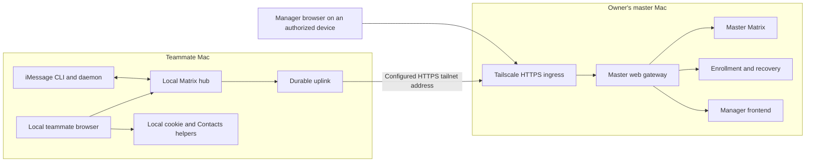

# Beepa implementation and deployment plan

**Date:** September 4, 2026

**Basis:** [Codebase review](CODEBASE-REVIEW-2026-09-04.md), baseline `040eb8c`, and the owner's subsequent deployment requirements.

**Status:** Approved software repairs implemented and automated checks passed. See the [implementation report](IMPLEMENTATION-REPORT-2026-09-04.md), [installation contract](INSTALL-CONTRACT.md), [master operations](MASTER-OPERATIONS.md), and [update guide](UPDATES.md). Beads records the remaining hardware, backup-configuration and rollout gates.

**Tracking:** Implementation epic `pm_mng-mdb`; planning task `pm_mng-mzq`. Beads owns task status and dependencies.

## Outcome and fixed requirements

Make Beepa reliable on independently installed teammates' computers, with a master on the owner's mostly-on personal Mac and communication over Tailscale. Teammates should be able to pull a supported release and apply it without losing bridge sessions, local/master pairings, consent, message history, or iMessage authorization.

**The current code authority model is the specification.** Documentation will be corrected to match it. Preserve explicit Private/Share/Direct, separate contact sharing, scoped master accounts, manager identity checks, room permissions, and all Direct send gates. Increasing history coverage must not increase the Direct sending rate, extend its freshness window, replay old proposals as real sends, or remove identity-change reconfirmation. Ordinary updates and ordinary restarts should require no new confirmation when the bound authority is unchanged.

The supported deployment is a trusted home system on a private tailnet. The plan retains that assumption, local convenience and existing Matrix authentication. Tailscale network membership does not silently turn a teammate into the manager. The manager bootstrap token must therefore remain local when we expose the manager web app on the tailnet.

### Decisions requested from the owner

The owner subsequently authorized implementation of the whole plan. These are the stated implementation defaults; hardware/backup destination details remain operational inputs:

| Question | Proposed default | Consequence of the alternative |
|---|---|---|
| Reconnect after master rebuild | Automatically recover when the same trusted pairing and its recovery material survive | A new enrollment code is simpler for a completely replaced database; teammate bridge logins still survive. |
| History coverage | All locally available history for currently shared conversations, paced in the background | A configured age window, initially 90 days, bounds archive growth. |
| First supported deployment | macOS master and teammates, already on the owner's Tailscale network | Supporting Windows/Linux requires separate host-service and credential-capture implementations and separate release gates. |

Before hardware acceptance, identify a second Mac/account and an operator-controlled self-chat destination. Before enabling scheduled backups, choose the owner's protected backup destination and retention. Those details do not block writing deterministic tests or repairing the ordinary restart/update path.

## 1. Identity and addresses: remove dependence on the author's device

Introduce one versioned installation manifest, consumed by setup, rendering, Python services, browser configuration and update tooling. Suggested fields:

```json
{
  "config_version": 1,
  "install_id": "generated-once-uuid",
  "role": "teammate",
  "local_localpart": "configured-or-os-derived-on-first-install",
  "display_name": "configured-display-name",
  "local_server_name": "localhost",
  "local_cs_base": "http://127.0.0.1:8008",
  "master_cs_base": "https://configured-master.tailnet-name.ts.net",
  "master_enroll_base": "https://configured-master.tailnet-name.ts.net:8443",
  "state_root": "resolved-persistent-path",
  "compose_project": "persisted-project-name",
  "imessage_cli_path": "resolved-existing-or-new-install-path"
}
```

The example is a shape, not a shipped file or a literal endpoint to copy. Secrets live in separate protected runtime files; the browser receives only the subset of configuration it needs.

**Identity precedence:** adopt a valid existing installation identity; otherwise use a supplied installation value; otherwise propose the currently logged-in OS account and display name. Validate once and persist. A later OS username change, repo rename or GitHub ownership change must not create a new Matrix account. Conflicting supplied/existing identities produce a clear migration error. The Mac login password is neither reused nor requested as the Matrix password: the authenticated OS session supplies the identity suggestion, and provisioning handles Matrix credentials.

Replace author-specific usernames, home directories, IDs and fallback values in all runtime paths, including both connection helpers, provisioning scripts, sample output, tests that unintentionally assume the author, and launchd generation. Obtain UID/GID and paths from the installation. Generate plists with a structured writer rather than replacing a particular author's path with `sed`. Locate Docker services through configured Compose projects/services rather than `matrix-wa-postgres-1`.

Master setup/update must adopt the **complete existing teammate roster**, not substitute the current OS username as a new one-person roster. Additions are additive; removals use the explicit removal operation. Repeated provisioning preserves existing account, token, space and roster entries. The current `master-setup.sh` → `master/provision.sh` roster rewrite is part of this repair.

Two compatibility distinctions prevent this cleanup from disconnecting installed users:

- Existing `@…:localhost` Matrix IDs are persistent identifiers; their suffix does not mean “connect to this browser's localhost.” Preserve existing homeserver identities. Configure network URLs independently.
- Existing `com.jkali.*` account-data/event types are historical protocol names, not the logged-in person's identity. Keep compatibility readers/writers for this stored data. New launchd labels can be neutral, but migrating existing labels must unload the old instance and start exactly one replacement. A cosmetic global search-and-replace must not erase consent or pairings.

### Persistent configuration and state

For new macOS installs, use a configurable data root with a default under `~/Library/Application Support/Beepa/` and logs under `~/Library/Logs/Beepa/`. Keep source code in the Git checkout. Record the active code location so moving a repo can update service launch paths deliberately.

For existing installations, initially adopt their current locations and explicit volume names. A later data-root migration must lock writers, make a consistent copy, verify it, switch configuration atomically, and record completion. Interruptions must leave one authoritative state location. **Do not automatically relocate the already-authorized iMessage executable.** Its recorded path remains valid through routine updates.

Configuration has three layers: tracked defaults, persistent operator overrides, generated effective files. Capture legacy differences from previously rendered defaults before replacing anything. Unknown drift requires review instead of silent overwrite. Validate effective config before activation and restart only the services whose effective configuration changed.

## 2. Tailscale topology without cross-machine localhost assumptions

### Desktop entry points (subsequent owner request)

The installer now creates **Beepa.app** for teammates and **Beepa Master.app**
for the manager in `~/Applications`. The standalone
`python3 desktop/install_apps.py` installs both for an existing setup. These
launchers open the existing browser interface, check reachability, and preserve
configured URLs on reinstall. They do not change authentication, run resets,
or replace the iMessage executable. Master setup can start the shared local
web interface independently of a teammate database. This implements the local
app entry points only; the remote gateway design below remains planned.
Implementation tracking: `pm_mng-mdb.8`.

The master stack will own the manager frontend; currently it depends on the teammate stack's `views` service. Add a master web gateway that serves the manager app and proxies its Matrix/enrollment requests. The remote manager browser uses same-origin relative API routes. Teammate uplinks use the configured master HTTPS address.



Continue using Tailscale Serve with local upstream listeners. Serve is the private-tailnet exposure mechanism; its background configuration can survive restart. Verify its actual status and advertised URLs during startup and diagnostics. [Tailscale Serve](https://tailscale.com/docs/features/tailscale-serve), [Serve CLI](https://tailscale.com/docs/reference/tailscale-cli/serve).

Keep compatibility with already-issued Matrix HTTPS and enrollment `:8443` addresses while introducing the unified gateway. Do not change existing client URLs simply to simplify routing. Future address changes use an explicit endpoint migration and preserve the existing Direct identity-binding behavior.

Generate CSP and accepted browser origins from validated configuration. No blanket wildcard is needed. Test the manager app from a second device: login, rooms, proposals/Direct, media and enrollment must make no request to that second device's `127.0.0.1:8018` or `8019`.

Cookie capture, Contacts access and iMessage continue to run on the teammate's own Mac. Their loopback addresses are correct and stay local. The remote gateway serves an allowlisted app build, **not the current entire filesystem root containing `session.local.json`**. Remote managers use the existing manager login flow; local passwordless bootstrap remains confined to the manager's local host.

## 3. Sync that survives a mostly-on laptop

### Model four different identities explicitly

| Value | Lifetime and purpose |
|---|---|
| Installation ID | Stable for one teammate installation, independent of Git repo path or OS display name. |
| Master authority ID | Stable for the trusted organization/master pairing; associated with its retained identity/recovery material. |
| Master data epoch | Changes when archive data is intentionally rebuilt or restored backward; unchanged for normal restart. |
| Mirror generation | Changes for a replacement destination room, including Private → Share after revocation. |

Account IDs, HTTPS endpoints and credentials remain separately recorded. Storage keys must include the destination/data epoch and mirror generation, not just the local event ID. Contacts rooms, contact versions, proposal-room discovery and pagination positions also need destination scope.

**Direct outcomes, ambiguity records, audit and rate counters are a separate safety ledger.** Keep them across app updates, archive rebuilds and ordinary reconnection. Rebuilding an archive must never clear evidence that a proposal may already have produced an external message.

### Separate ingestion from remote delivery

The local Matrix hub remains the durable source of retained messages. The uplink records event references and recovery jobs in SQLite, then can advance its ingestion position once those references/gaps are durable. Remote delivery has a separate committed position. A sleeping master does not require holding an unbounded array in memory, repeatedly downloading identical batches, or delaying local ingestion indefinitely.

Jobs carry destination, source room/event references, consent version, pagination boundary, state and next retry time. Refetch content from the local source when required. Avoid introducing unnecessary persistent message-body copies, particularly in the iMessage bridge's IDs/hashes-only journal. If a source event becomes unavailable, record a visible incomplete/refused outcome rather than declaring it delivered.

### Make history and mirror lifecycle resumable

Represent mirror progress explicitly: allocation intent → room discovered/created → space linked → history discovered → history delivered → live. Revoking is a durable independent state that suppresses new forwarding immediately.

Persist returned room IDs immediately. Include a stable generation marker so recovery can discover and adopt a room after an ambiguous `createRoom` response. Resolve that ambiguity before repeating creation; verify the marker, owner and generation before adoption. Do not resurrect obsolete bridge portal generations or unrelated orphan rooms.

Handle `timeline.limited` in both message and proposal streams. Record the gap boundaries, paginate until the known anchor or a verified history boundary, deduplicate within the active destination generation, and apply edits/redactions to the correct target. Tokens are opaque. Empty pages, repeated tokens, invalidated cursors and unavailable history all require explicit outcomes. Matrix's sync response alone is not a complete delivery ledger. [Matrix syncing](https://spec.matrix.org/v1.15/client-server-api/#syncing).

Historical events should appear in source order. Backward discovery can stage IDs on disk before chronological delivery; dependent edits/redactions wait for their target or receive a defined missing-target disposition. New/live messages should remain responsive during large backfills; the frontend must use source timestamps when merging delayed history.

Use deterministic transaction IDs within a destination generation, but do not promise universal exactly-once delivery: Matrix transaction deduplication is scoped to the relevant client credentials, and native external sends can time out after dispatch. Test credential rotation and response-loss windows. For uncertain sends, inspect/adopt existing remote evidence where available; otherwise surface ambiguity instead of blindly repeating external actions. [Matrix transaction identifiers](https://spec.matrix.org/v1.15/client-server-api/#transaction-identifiers).

### Expand coverage with bounded execution

Remove the hard-coded 500-event archive ceiling. Proposed initial settings, tunable after measurement:

| Setting | Proposed default |
|---|---|
| Archive coverage | All history still retained on the local hub; optional age policy |
| Page size | 200 events, respecting smaller server responses |
| Concurrent historical rooms | 2 |
| Work slice | At most 1 page or roughly 5 seconds before yielding to higher-priority work |
| Message/proposal outage catch-up | No silent lifetime event-count cap; paginated until covered |
| Media | Keep bounded bytes and current size controls; track retryable media separately from permanent placeholders |
| Direct freshness/rate/body/target gates | Existing values and semantics unchanged |

This expands local-to-master synchronization. It does not automatically enable aggressive provider-side backfill or recover messages a bridge never imported. Instagram's deliberately limited provider backfill remains an independent setting. For iMessage, confirm the pinned CLI's actual history API before promising pagination or removing its recent-window limitations.

### Priorities and retry isolation

Use independent schedules and retry state for local ingestion, current message delivery, proposals, contact synchronization, revocation and historical work. A contact-store error must not stop messages. Apply connection/consent changes before each outgoing slice; check Private/disconnected state again before dispatch. Prioritize revocations over new allocations/backfill. A request already in flight cannot be unsent; the contract applies to subsequent dispatch once the change is observed.

Distinguish offline/timeouts, HTTP 429, invalid credentials, permanent API errors, incompatible schemas, disk-full and database corruption. Honor server retry delays, add jitter, and cap transient backoff at a proposed 60 seconds. Wake/network return should schedule an immediate health/reconnect attempt. Keep storage/permission failures visible instead of calling all of them contacts locks.

Show last successful ingestion/delivery, oldest pending item, backlog/coverage, pending cleanup, media failures and the actual failing subsystem. “Process running” and “fully synchronized” are separate states. Define ledger retention only after replay requirements are proved; don't prune event outcomes merely because one hour has elapsed.

## 4. Restarting, restoring and resetting the master

The current root [reset.sh](../reset.sh) destroys both stacks' volumes and much of their identity/session state. It is a factory-reset operation, even though it now preserves the iMessage executable by default. It must never be called by the updater or normal master restart tooling.

### Distinct supported operations

| Operation | What is retained | Required behavior |
|---|---|---|
| Restart / sleep and wake / temporary tailnet loss | All state and credentials | Automatically reconnect and resume. No enrollment or bridge login. |
| Rebuild master archive while retaining authentication state | Master accounts/tokens, pairing/identity and teammate data | Bump data epoch; rebuild only currently authorized copies. No teammate bridge logout. Prefer this for an intentional archive refresh. |
| Restore complete master backup | Backed-up database, media, keys, roster and config | Bump restore epoch; reconcile clients whose local mappings are ahead of the backup. Tokens issued after the backup may require recovery. |
| Replace master database, retain identity/recovery bundle | Trusted master identity, roster and per-install recovery registry | Recreate scoped accounts, recover scoped credentials, start a new data epoch and rehydrate current shares. |
| Lose master identity and recovery material too | Teammates still keep their local hubs/sessions | Fresh pairing is necessary. Preserve the current Direct replacement-authority reconfirmation behavior. |
| Teammate factory reset | Only explicitly exported backups | Deliberately destructive; separate from every operation above. |

Old access tokens do not survive deleting the database rows that define them. Keeping the master password-derivation key can recreate account passwords, but it cannot resurrect those token rows. Thus a full database replacement needs either new enrollment or the recovery mechanism below.

“Rebuild archive while retaining authentication” means replacing Beepa-managed mirror generations through supported room operations and reconciling their current visibility. It does not mean manually deleting selected Synapse database tables. Old generations are retired under the existing retention contract; a stronger data purge is not silently added.

### Automatic reconnect after a database replacement

The proposed mechanism is a **per-install recovery credential scoped only to that installation's existing teammate account**. Issue it through an authenticated existing pairing or first enrollment, and store its verifier/account binding/revocation record outside the resettable archive database. The teammate stores only its own credential. Master-wide registration and password-derivation secrets stay on the master.

Recovery verifies the expected trusted master and the per-install credential, recreates/retrieves that same scoped account, and returns fresh connection data plus the data epoch. Freeze the authenticated manifest and recovery-message format in the contract phase, using established cryptographic/TLS mechanisms. Matching a hostname or Matrix localpart alone is insufficient proof of continuity. A disabled local link, revoked pairing or changed authority must not silently recover.

This is credential lifecycle work, not an expansion of the authority model: it must not grant a different teammate, manager power, or any new Direct permission. Ordinary restart uses the existing token. Restoring an archive does not restore an obsolete authorization/revocation registry over a newer one. If the latest trusted recovery records cannot be recovered, use a fresh enrollment code instead of guessing.

Existing installations first receive the compatible recovery credential while their current token works. Do not ship a reset mechanism that assumes every old client already has it. Endpoint/manager changes continue through the current Direct suspension/reconfirmation flow.

### Backup content and restore sequence

A consistent master backup includes PostgreSQL, media, install manifest, `.env`, signing key, password/registration secrets, roster, enrollment state, authority/recovery registry, data epoch and release/schema metadata. The first supported backup implementation should briefly quiesce master writers, take a coordinated snapshot/export, checksum it, verify readability, and resume. An encrypted backup copy and identity/recovery bundle must exist outside the reset target and preferably outside the laptop itself.

Restore sequence: stop master writers/ingress → validate backup/version/identity → restore consistent stores → allocate a fresh data/restore epoch → start master locally → reconcile current account, pairing and recorded session revocations into the restored authentication state → verify authentication → reopen/verify Tailscale ingress → let upgraded teammates reconcile destination state → rebuild currently shared history → report coverage. Local Private decisions always win over old backup contents for new forwarding.

An old backup can resurrect a token or account revoked after the snapshot. Retain current revocation records with recovery material outside the archive rollback. If current authorization cannot be established, invalidate/quarantine affected restored sessions and use scoped recovery or fresh pairing; do not expose the old snapshot as current authority. This must be tested before restore is considered supported.

A full backup also preserves master-only information such as manager proposals and account administration. Rehydrating from teammates alone cannot guarantee recovery of unsaved manager-only data. Preserve proposal outcome IDs locally so restored historical proposals cannot become duplicate external sends.

### What the owner can do today

For an ordinary startup of the existing master, from the repo on the master laptop:

```sh
docker compose -p matrix-master --env-file master/.env \
  -f master/docker-compose.master.yml up -d
```

For restarting its existing containers without deleting their volumes:

```sh
docker compose -p matrix-master --env-file master/.env \
  -f master/docker-compose.master.yml restart
```

These commands do not rebuild lost state or repair the review's sync bugs. Keep the existing database, media and master identity files until the new recovery tooling passes its isolated restore drill. Do not use `down -v`, delete the uplink database, or run root `reset.sh` as a reconnect recipe. Verify the enrollment launch agent and Tailscale Serve after startup; rerun the existing exposure helper only if mappings need repair.

Keep the master Mac logged in with Docker/Tailscale running, and awake while immediate synchronization is needed. The application will tolerate sleep/offline periods through eventual catch-up; it cannot provide live manager access while the laptop is asleep. Teammates also need to retain their source history long enough for recovery.

## 5. iMessage: repair durability without disturbing authorization

The existing [build-cli.sh](../imessage/build-cli.sh) downloads a pinned upstream prebuilt, verifies SHA-256 and Developer ID team, and leaves an existing executable untouched. Retain this route. The updater must not rebuild, re-sign, relocate or replace that executable during Python/UI/schema fixes. Remove stale Swift-compilation prerequisite checks from setup because they do not belong to this download path. Separately validate/provision the Python interpreter needed by the host daemons; some shipped plists currently name Command Line Tools' Python, and a prebuilt iMessage CLI does not supply that runtime.

Refactor daemon initialization enough to inject config, temporary state, a fake native CLI and a fault-injecting Matrix transport. Importing it in tests must not open the real database, launch Messages or read real credentials. Keep all existing sender, mapped-room, attachment-path and command guards.

**Inbound:** record pending source IDs/components; mark complete only after required deliveries or explicit terminal dispositions. Use stable transaction IDs for text/attachments and resumable backfill/cursors. Fix the initial-backfill completion marker as well as ordinary polling. A successful attachment plus failed text must not duplicate the attachment when retried.

**Outbound:** use durable event-level claims and outcomes: queued, dispatching, confirmed, retryable, refused or ambiguous. Appservice HTTP acceptance means the event is durably recoverable, not that the recipient received it. A mixed transaction must not resend successful messages because another item failed. Prevent concurrent duplicate dispatch and late event replays. Timeouts after possible engine dispatch become ambiguous and must not be blindly retried. Retain references/IDs/hashes and refetch source events rather than casually adding a message-body spool.

Read structured engine outcomes where available; a zero process exit or boolean is not sufficient recipient-delivery evidence. Preserve the current Direct ambiguity behavior on the uplink side. Correct outgoing attribution only for the configured, verified iMessage bot/source, not arbitrary message metadata.

Native CLI upgrades are a separate, deliberate release action with their own artifact/version/checksum, signature, rollback and hardware checks. Do not promise that TCC grants transfer between computers or survive every binary replacement. A new teammate must grant Full Disk Access, Accessibility and Automation to the actual executable as required. Do not gate sends on Python's accessibility identity or bypass TCC. Use engine results and an authorized self-chat inbound nonce round-trip; the primary `chat.db` outgoing rows are not the delivery oracle in this integration.

The first reliability release should leave the installed native binary unchanged. Fresh install tests must cover available/unavailable download, denied/granted permissions and repeat installation. App-only upgrade tests compare executable checksum, path, signature and inode before/after.

## 6. Git distribution and applying updates without breaking pairings

### One upstream and a preserved history

Use the current canonical repository (`jacob-recall/beepa`, unless the owner chooses another) as `upstream`. Each person's GitHub repository should be a fork, or retain the same Git commit history and an upstream remote. Keep deployment-specific values outside tracked code. Avoid recreating the project with `git init` or ZIP copies; those lose the straightforward ancestry needed for predictable updates.

Publish immutable release tags and a tested `stable` deployment branch. `main` can continue development. A fork does not update simply because its upstream changed; the owner must propagate the tested stable commits to each fork first. [GitHub fork synchronization](https://docs.github.com/en/pull-requests/how-tos/work-with-forks/syncing-a-fork).

One-time fork setup and release propagation will be documented with the selected branch names. For a clean fork already on its deployment branch, the intended operator sequence is:

```sh
git fetch upstream --tags
git merge --ff-only upstream/stable
git push origin stable
```

Only run that against a fork you control and after its `upstream` remote is configured. Divergence must stop for review; don't reset or force-push collaborators' changes. If someone needs code customization, keep it on a separate branch with reviewed merges, not as an untracked exception to the update contract. Existing unrelated-history copies require a one-time code checkout migration that adopts their runtime state; not an automatic unrelated-history merge.

### Pull plus an explicit apply step

The planned user workflow is:

```sh
git pull --ff-only
./update.sh
```

**`update.sh` is now implemented.** Run it to inspect, then use `./update.sh --apply` to activate a supported committed release. It applies services and schema changes after Git updates source. Fast-forward-only pulls stop on divergent history instead of manufacturing a merge. [Git pull](https://git-scm.com/docs/git-pull).

The updater will:

1. Acquire a per-install operation lock; identify role, installed release, target release and supported schema/peer versions.
2. Refuse incompatible migrations or conflicting tracked modifications with actionable instructions. Resolve install state from the persisted manifest, never from the new repo owner's username.
3. Inventory account IDs, volume names, credential fingerprints, consent, Direct outcomes/counters and native executable identity without printing secrets.
4. Stage image pulls, effective config and required source artifacts before stopping services. Validate checksums/config, disk space and migration prerequisites.
5. Take a consistent pre-migration backup and persist a restartable migration journal. Validate legacy state before adopting or moving it.
6. Stop only affected writers, apply ordered idempotent migrations, atomically activate config, and restart affected services. Ordinary app releases leave bridge sessions and the iMessage executable alone.
7. Check local/master authentication, bridge readiness, endpoint advertisement and actual sync progress. An offline master is reported as pending verification rather than causing a factory reset or endless re-enrollment.
8. Record completion, backup location, active release and any pending verification. Running the same update again is safe.

Keep the runtime on a stable active release while another Git pull changes the checkout: stage Python/static app code into a versioned runtime release directory and switch it only during apply, or equivalently use a tested service-quiescing activation design. Do not mix old Python processes with newly bind-mounted JavaScript halfway through an update. The separately pinned iMessage binary remains at its recorded stable path.

Preserve existing Compose project/volume names explicitly. Compose recreates changed containers while retaining mounted volumes, but selecting a new project/volume can instead create an empty installation. That invariant belongs in tests, not just operator memory. [Compose up](https://docs.docker.com/reference/cli/docker/compose/up/), [Compose project configuration](https://docs.docker.com/reference/cli/docker/compose/).

### Compatibility and rollback

First establish and test a compatibility window of release N with N−1 peers. Include older-install fixtures for the initial transition. Add wire fields before requiring them; retain legacy account-data readers. A laptop that skipped several releases follows the tested ordered migrations or stops with a supported intermediate-release instruction. Never assume arbitrary version skew is safe.

Roll out master first, then one canary teammate, then remaining forks/laptops. The master update must continue serving the previous teammate release. Long-offline teammates should reconnect on their old supported version and receive a clear update requirement if too old.

Rollback switches code only when that code supports the current schema. Otherwise restore a coordinated compatible snapshot, with a new restore epoch and explicit handling of messages accepted since the snapshot. Do not roll Direct/iMessage outcome ledgers backward and blindly resend. Favor additive schema migrations and a delayed cleanup release so ordinary rollback does not require data restoration.

Third-party services can independently expire a login; updates cannot guarantee otherwise. The release guarantee is that **our upgrade process does not rotate/delete the keys, tokens, accounts or bridge databases that maintain those logins**.

## 7. Reproducible bugs and regression acceptance

Use the review's 11 offline demonstrations as evidence, then turn them into tests of the intended repaired behavior. The current evidence scripts deliberately assert defects and are not the final regression suite. Each repair should have a failing production-function/handler test before the implementation and a passing result afterward.

| Finding / scenario | Regression required |
|---|---|
| R1 documentation | Current UI/documented Private/Share/Direct contract agrees with tested runtime; all existing Direct gate tests stay green. |
| R2 retained history | Isolated Matrix test demonstrates the actual post-kick history behavior; UI/docs promise stopped future sharing and accurate retention, not purge. |
| R3 failed revocation | Fail unlink, kick and leave individually with 429/503/permission errors; no further forwarding, cleanup record retained, retry completes, no premature owner leave. |
| R4 Disconnect | CLI-only, GUI-only and mixed installs; explicit disabled state beats credentials; restart/read failure never reconnects it; cleanup status persists. |
| R5 limited timeline | Several pages, empty pages, repeated cursor, invalid cursor, response loss, more than 500 messages and 100 proposals; no silent gaps; stale proposals only enter inbox. |
| R6 backfill | Crash after every allocation/link/page/acceptance/commit boundary; adopt the correct partial room; no blind duplicate creation/delivery; report unresolved ambiguity when remote evidence cannot establish the result. |
| R7 re-share | Share → Private → Share; fresh mirror has intended history; edit/redaction relationships resolve within its generation. |
| R8 iMessage inbound | Portal/text/attachment failure, partial multi-part success, unchanged chat timestamp, initial cap exhaustion, restart, edits/reactions, source history beyond 25 messages. |
| R8 iMessage outbound | Failure before/after dispatch, mixed transactions, repeated event in another transaction, replay after one hour, concurrent requests, lost CLI result, deleted temporary attachment, grant refusal; no blind ambiguous resend. |
| R9 identity | At least two non-author usernames, explicit value, OS-derived value, unusual path/XML characters, changed UID and repeated install; all permission and login identities agree. |
| R10 consent timing | Private/disconnect in the same sync response and mid-backfill; further work is suppressed before the next dispatch; pending revocation is visible. |
| R11 master change | Different authority, same URL with new data epoch, different endpoint, stale contacts state and old backup restore; destination data reset, Direct outcomes/caps preserved. |
| R12 attribution | Verified configured iMessage bot true/false marker, wrong bot/source, custom identity/domain, attachments and edits. |
| R13 UI race | Resolve A/B room loads out of order, logout/login while requests are pending, stale poll responses; exactly one current watcher with its own cursor. |
| R14 config rerun | Operator history/port overrides survive two updates; invalid config rejected before activation; changed effective config triggers correct service restart. |
| R15 isolation | Contacts lock/corruption, master/local timeout, permanent 400/401, 429, disk full and clock/wake changes; independent progress and accurate status. |
| Partial media failure | Upload/download failure is classified; retryable media is recoverable without duplicate message; permanent size refusal is an explicit placeholder. |
| Master lifecycle | Ordinary restart preserves IDs/tokens; archive rebuild preserves auth; old backup restore repairs ahead-of-master dedup state; DB replacement recovers only a valid pairing. |
| Recovery refusal | Revoked/disabled/wrong-install credentials fail; new authority requires pairing; missing newest recovery registry does not resurrect stale authorization. |
| Restored authorization | Token/account valid at backup, revoked afterward, then restored; still refused before ingress reopens. Missing latest records requires quarantine/recovery. |
| Rotated-token ambiguity | Destination accepts send/create, response is lost, token changes, same transaction is retried; use verified generation-scoped evidence or explicit ambiguity rather than assuming server dedup survives credential rotation. |
| Normal upgrade | Legacy fixture → target release → same update again; accounts/tokens/volumes/consent/native binary and Direct outcomes remain stable. |
| Roster preservation | Multiple enrolled teammates plus one addition; setup/update twice preserves every prior account, token, space and roster entry. |
| Interrupted upgrade | Kill at each journaled step; resume once; no competing state roots or duplicate launchd daemons. |
| Release propagation | Clean fork fast-forward succeeds; dirty/diverged/unrelated history fails safely; N/N−1 peers and skipped-release migrations are exercised. |
| Source/contact structure | Shared registry parity, nested live community rooms, obsolete portal generations excluded, contact pagination beyond 2,000, international/trunk/extension numbers. |
| HTTP/runtime limits | Bounded body/read deadlines, malformed enrollment/config, slow client, actual subsystem health; retain current legitimate origin and authority checks. |

### Test infrastructure

Build disposable **local and master** homeservers with generated credentials/configuration, explicit unique project names and allocated ports. The current harness must stop reading `master/tokens.local` or requiring modification of the real roster. Have an explicit test-root marker and make cleanup refuse non-test resources. Fake transports/CLI drive fault injection; real homeservers verify Matrix behavior. Production secrets, Contacts, Messages and bridge sessions are never fixtures.

Keep the 36 existing unit scripts and consent conformance run as the baseline. Add native supported Node/Python validation plus the pinned CI runtime; record exact versions instead of calling a floating image tag pinned. Run syntax/lint appropriate to changed code, migration tests, browser tests and isolated E2E from one documented command. No large refactor precedes the tests that protect its lifecycle.

### Load and hardware gates

Initial repeatable scale fixture: 100 rooms and 100,000 events, a simulated 72-hour master outage, contacts/proposals and edits/redactions mixed in. Verify bounded memory (initial target under 512 MiB for the uplink), durable progress after repeated crashes, and current-message processing while history runs. In the controlled healthy integration environment, target ordinary small-message mirror/proposal latency under 15 seconds and reconnect within 60 seconds of restored readiness. These are targets to measure/tune, not claims about current behavior or arbitrary WAN/provider latency.

Fresh-device acceptance requires a second macOS user/device, different username and checkout path, actual Tailscale access, a new install, denied/granted FDA/Accessibility/Automation, launchd operation, sleep/wake and an app-only upgrade. Later native-CLI upgrades get a separate gate. Real sends use only the operator-authorized self-test destination; existing `--i-am-sending-to-myself` protection remains. A container or mocked CLI test cannot certify macOS authorization on a new device.

Repair the live verifier before relying on it: `tests/live/self_send_verify.py` currently accepts a nonce from any sender other than the local user, while the iMessage daemon can represent outgoing traffic as the bot with `from_me: true`. Add a deterministic outgoing-echo false-positive case and require verified inbound attribution or supported engine delivery evidence. A bot echo alone cannot pass the hardware gate. This additional issue was identified by source inspection during planning, not reproduced against a real recipient.

## 8. Work sequence and subagent ownership

Three specialist subagents reviewed sync/reset, portable updates, and iMessage/test isolation in parallel for this plan. For implementation, use the root integrator plus at most three concurrent implementation agents. Ownership is by files/subsystems; tests may be developed independently, but two agents should not concurrently edit the same uplink/schema functions.

| Phase | Parallel work | Exit gate |
|---|---|---|
| 0 — Contracts and baseline | Integrator freezes identity/storage/compatibility contracts; agent A builds disposable harness; B inventories install/config migration; C builds iMessage fakes and regressions | Legacy fixtures load; isolated tests cannot touch production; authority contract explicit. |
| 1 — Correctness | A owns uplink schema/connection/consent/gap/backfill; B owns neutral identity/config and updater foundations; C owns iMessage durability; integrator handles UI watcher/doc contract or independent review | R3–R15 targeted tests pass; all existing authority/conformance tests retained. |
| 2 — Deployment and recovery | A owns master data epochs/restore/reconnect; B owns tailnet frontend and release application; C owns fresh-install/downloader tests and integration fault drills | Restart/update/rebuild/restore all tested with local sessions preserved. |
| 3 — Structural completion | Extract shared UI leaves, index generation-scoped lookup, source registry, nested portals, contacts pagination/normalization and HTTP/health limits | Structural recommendations covered; no behavioral/authority regressions. |
| 4 — Release | Master canary, second-machine teammate, sleep/offline/update drill; then propagate same tested commits to forks | Hardware gates and N/N−1 compatibility pass; backups/restoration verified; documented rollback ready. |

Within phase 1, schema/scheduler foundations and explicit disconnect precede expanded historical replay. Within phase 2, recovery uses the same schema/updater contracts rather than introducing a second state format. Small fixes can land in reviewable increments, but the owner-facing reset/rebuild command must not ship before its end-to-end gate.

### Durable work map

| Work | Beads |
|---|---|
| Implementation epic | `pm_mng-mdb` |
| Contracts and legacy fixture format | `pm_mng-mdb.1` |
| Disposable tests and failure injection | `pm_mng-mdb.2` |
| Configurable tailnet manager/master gateway | `pm_mng-mdb.3` |
| Master lifecycle and recovery | `pm_mng-mdb.4` |
| Journaled updater, compatibility and Git distribution | `pm_mng-mdb.5` |
| Structural/source/contact/scale completion | `pm_mng-mdb.6` |
| Hardware, compatibility and rollout acceptance | `pm_mng-mdb.7` |
| Disconnect/revocation | `pm_mng-drh` |
| Gap/backfill/re-share repair | `pm_mng-8v3` |
| iMessage durable outcomes/attribution | `pm_mng-6ji` |
| Configured installation identity | `pm_mng-mob` |
| Operator configuration preservation | `pm_mng-2am` |
| UI watcher race | `pm_mng-kk4` |
| Code-authoritative documentation | `pm_mng-0ih` |
| Scheduler/resilience/master binding | `pm_mng-1qf` |

Existing `pm_mng-q71`, `pm_mng-5jq`, `pm_mng-syy` cover service-label migration, nested communities and international numbers; coordinate these with the structural/install owners instead of duplicating implementations. Beads blocking dependencies are recorded and checked for cycles.

## Completion criteria

An independently installed teammate can retain their connected networks while the master sleeps, restarts, receives a release or rebuilds its archive. When both sides are available, all retained and currently authorized history within the chosen policy converges with visible coverage and explicit unresolved outcomes. Pull/apply preserves stable identities and durable send outcomes. A fresh Mac can download and authorize the existing signed iMessage CLI through the documented supported path. Every review finding has a regression, documented intended behavior, or a clearly identified hardware/scale acceptance gate.

The plan does not claim unrecoverable provider history, retracting other people's copies, automatic migration of macOS permissions, or recipient delivery when only local acceptance is known. Those limits are reflected in the product wording while the current authority model remains intact.
