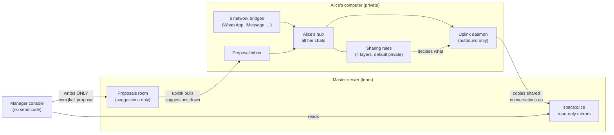

# Beepa — System Design & Data Schema

*A specific but plain-language explanation of what the app stores, where, and
why the sharing model is safe. Written for a non-technical reader; every
object is named exactly as it appears in the code so engineers can follow the
same map. Verified against the running system on 2026-08-28.*

## What Beepa is, in one paragraph

Each team member runs Beepa on their own computer. It gathers that person's
chats from six messaging networks — WhatsApp, iMessage, Google Messages,
Instagram, LinkedIn and X — into one private inbox that only they can open.
Separately, the team runs one always-on "master" server. Each teammate
chooses, conversation by conversation, what to share; only those conversations
are *copied* to the master, where the manager can **read** them and **suggest**
replies — but can never send a message as anyone. Everything runs on our own
machines; no chat content is sent to any third-party service.

## The three places data lives

| Place | Who controls it | What's in it |
|---|---|---|
| **Teammate's hub** (their own computer) | The teammate | The full, private copy of all their chats, their sharing choices, their address book groupings |
| **Master server** (one shared machine) | The team | *Copies* of only the shared conversations, one folder per teammate, plus the manager's suggestion drafts |
| **The messaging networks** (WhatsApp etc.) | The outside world | The real accounts. Only the teammate's own machine holds the keys to them — the master never does |

The key property: the master holds a **copy, never a capability**. Nothing on
the master server can log into anyone's WhatsApp, and nothing on it can send.

## The schema — the eight kinds of objects

### 1. Conversation
One chat thread (a person or group on one network). Technically a Matrix
"room" on the teammate's hub. Fields the app cares about: a validated room id,
a display name, which **Source** it came from, and its recent messages.
Messages are stored with who sent them, when, and the text — the UI
deliberately renders only plain text (never rich HTML, never attachment
filenames) to keep hostile content inert.

### 2. Source
Which network a conversation came from. Exactly six live values:
`whatsapp`, `imessage`, `gmessages`, `instagram`, `linkedin`, `twitter`.
Each source is a "bridge" — a connector logged in *as the teammate* on their
own machine (defined in `shared/ui/sources.js`).

### 3. Sharing choice (the consent policy) — the heart of the design
A teammate's sharing rules are four layers, and **the most specific rule
always wins**. Stored on the teammate's own hub, in their own account:

| Layer (most specific first) | Possible values | Stored as |
|---|---|---|
| 1. This one conversation | share / private | `com.jkali.share_override` (per-room) |
| 2. This person (contact profile) | share / private / no opinion | inside `com.jkali.contact_profiles` |
| 3. This whole network (e.g. "all my LinkedIn") | share all / keep all private | `com.jkali.share_policy` → `sources` |
| 4. Everything (global switch) | share all / private | `com.jkali.share_policy` → `global` |

If no rule says "share", the answer is **private — that is the default for
everything.** This decision logic exists twice by design — once in the app
(JavaScript, `shared/model/consent.js`) so the teammate sees exactly what will
happen, and once in the sync daemon (Python, `agents/uplink/consent.py`) which
actually enforces it — and automated tests hold the two identical.

### 4. Contact profile ("one person, many networks")
A teammate can group conversations that are really the same human — e.g.
"Dana" on WhatsApp *and* LinkedIn — into one profile:
`{ id, displayName, roomIds[], share }`. A conversation can belong to at most
one profile, and profiles are created only by hand (the app *suggests*
matches, it never merges on its own). Setting a profile to "share" or
"private" moves that whole person at once (layer 2 above). Stored as
`com.jkali.contact_profiles` on the teammate's hub.

### 5. Mirror
The copy of one shared conversation on the master server. Created by the
teammate's **uplink** daemon (never by the manager), inside that teammate's
folder (`space:<name>`), with the rulebook fixed at the moment of creation:
teammate's sync account may write, **manager may only read** (power level 0).
Each mirror is stamped with machine-readable labels the manager's console
uses:

| Stamp | Meaning |
|---|---|
| `com.jkali.source` | which network this thread came from (badge) |
| `com.jkali.profile` | which person-grouping it belongs to, if shared as a profile |
| `com.jkali.mirror_of` | which conversation on the teammate's hub it is a copy of |
| on every copied message: `com.jkali.from_me`, `com.jkali.origin_ts`, `com.jkali.origin_sender` | was it the teammate speaking, the original timestamp, and the original sender's name |

**Un-sharing deletes the mirror**: the uplink unlinks it from the teammate's
folder, kicks the manager out, and leaves. The manager loses all access; new
messages never flow again.

### 6. Proposal (the manager's only "write")
A suggestion, not a message. When the manager types a reply in the console, it
is saved as a `com.jkali.proposal` event — `{ target_room, body, created_by,
origin_ts }` — into a dedicated per-teammate **Proposals room**, which is the
*only* room on the master where the manager can write, and even there only
this one event type (the room's rules make normal messages impossible for
them). The teammate's uplink pulls each proposal down into a private inbox on
their own hub; the teammate reads it and may send it, edit it, or dismiss it.
**Only the teammate's own account, on their own machine, through the app's
one guarded send function, can turn a proposal into a real message.**

### 7. Enrollment code (how a teammate joins)
The manager clicks "Add teammate"; the master registers the account, creates
the read-only folder, and mints a one-time code (10-minute lifetime; only a
fingerprint of the code is stored, never the code itself). The teammate pastes
the code into Settings → "Connect to organization"; their hub exchanges it for
credentials scoped to *them alone* and stores them as `com.jkali.master_link`
on their own hub. Their uplink picks that up and starts mirroring. A code
works exactly once.

### 8. The uplink's ledger (why nothing duplicates or leaks)
The sync daemon keeps a small private database (`state.db`, owner-readable
only) with four tables: `mirror_rooms` (which local conversation maps to which
mirror), `event_map` (every message already copied up — so a restart never
copies twice), `proposal_map` (every suggestion already pulled down — same
guarantee downward), and `meta` (its place in the message stream, advanced
only after the master confirms receipt, so an outage never loses messages).

## What the manager can and cannot do

| Manager can | Manager cannot |
|---|---|
| Read conversations each teammate chose to share | See anything not explicitly shared (default is private) |
| See who/which network/when for shared threads | Send a message as anyone, anywhere — the console has no send code, and the server rules would reject it anyway |
| Leave a reply *suggestion* for a teammate | Put words in a chat directly — only the teammate can send, from their machine |
| Add a teammate (issues a one-time join code) | Log into anyone's WhatsApp/iMessage/etc. — those keys never leave the teammate's machine |
| Lose access when a teammate un-shares | Retain or regain access after revocation |

Those guarantees are enforced in **five independent layers** (each was
verified in this audit): the default-private consent resolver; the uplink
mirroring only consent-approved rooms; server-side read-only rules stamped
into every mirror at creation; a manager console built with no sending code at
all; and the rule that a suggestion becomes a message only through the
teammate's own guarded send path.

## One story, end to end

1. Dana messages Alice on WhatsApp → the bridge on Alice's machine files it
   into her private hub. Nobody else can see it.
2. Alice groups Dana's WhatsApp and LinkedIn threads into one "Dana" profile
   and marks the profile **Shared**.
3. Within ~30 seconds Alice's uplink creates two mirrors in `space:alice` on
   the master (manager read-only, stamped `source` + `profile: Dana`) and
   copies the recent history up, each message tagged with its true time and
   speaker.
4. The manager opens the console, sees "Dana — 2 threads" under Alice, reads,
   and clicks *Suggest a reply*: "Offer her the Tuesday slot." That's a
   `com.jkali.proposal` in Alice's proposals room — nothing was sent.
5. Alice's inbox shows the draft. She edits it, presses Send — *her* account,
   *her* machine, through the app's one validated send path — and Dana gets a
   normal WhatsApp message from Alice.
6. A week later Alice sets the profile to **Private**. The mirrors are
   unlinked, the manager is kicked from them, and nothing new ever flows.

## Diagram

*Caveat for completeness: the audit that produced this document confirmed the
design above is real in the code, with a short list of quality issues (none
breaking the guarantees) recorded in `docs/AUDIT-FINDINGS.md`.*
